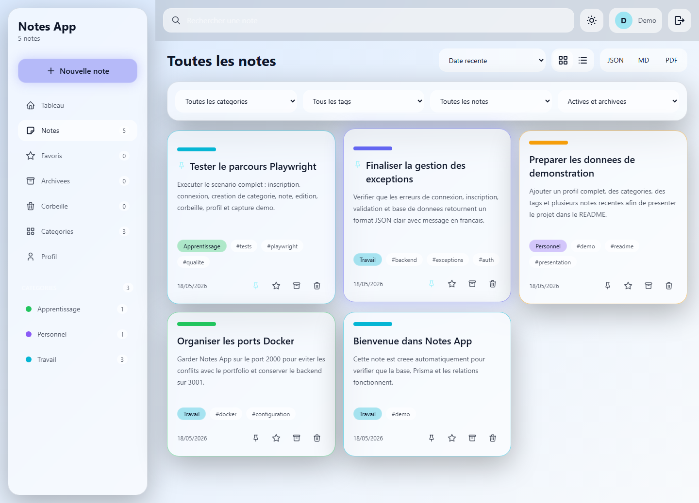

# Notes App

Application de gestion de notes personnelles en monorepo :

- `backend/` : API REST NestJS, PostgreSQL, Prisma, JWT, Swagger.
- `frontend/` : React 18, Vite, TypeScript, Tailwind CSS, Zustand.
- `docker-compose.yml` : environnement local complet.

## Capture demo



## Demarrage rapide

```bash
docker-compose up --build
```

Au demarrage Docker, le backend attend que PostgreSQL soit pret, applique les migrations Prisma, puis lance le seed local si `SEED_DEMO_DATA=true`.

Compte demo cree en local :

- Email : `demo@notes.local`
- Mot de passe : `password123`

## Donnees de test

Profil utilisateur exemple :

- Prenom : `Kenny`
- Nom : `Testeur`
- Email : `demo@notes.local`
- Date de naissance : `1995-04-13`
- Lieu de naissance : `Antananarivo`
- Poste : `Developpeur backend`
- CIN : `101011234567`
- Accroche : `Developpeur backend rigoureux et oriente solution, je concois des API fiables, securisees et maintenables.`
- Mes atouts : `Rigueur, autonomie, curiosite technique, resolution de probleme, qualite du code et esprit d'equipe.`

Categories exemple :

- `Travail` - couleur `#6366f1` - icone `Briefcase`
- `Apprentissage` - couleur `#06b6d4` - icone `Book`
- `Personnel` - couleur `#22c55e` - icone `Heart`

Exemples de notes :

1. `Preparation API Notes`
   - Categorie : `Travail`
   - Tags : `nestjs`, `prisma`, `api`
   - Couleur : `#6366f1`
   - Contenu : `Verifier les endpoints auth, notes, categories et tags. Controler les erreurs en francais et le format JSON standardise.`

2. `Plan de revision TypeScript`
   - Categorie : `Apprentissage`
   - Tags : `typescript`, `react`, `tests`
   - Couleur : `#06b6d4`
   - Contenu : `Revoir les types generiques, les hooks React, Zustand, les DTOs et les tests Playwright pour consolider le projet.`

3. `Idees personnelles`
   - Categorie : `Personnel`
   - Tags : `objectifs`, `organisation`
   - Couleur : `#22c55e`
   - Contenu : `Noter les objectifs de la semaine, classer les priorites et epingler les notes importantes pour les retrouver rapidement.`

Notes projet recentes ajoutees au seed :

1. `Finaliser la gestion des exceptions`
   - Categorie : `Travail`
   - Tags : `backend`, `exceptions`, `auth`
   - Couleur : `#6366f1`
   - Contenu : `Verifier que les erreurs de connexion, inscription, validation et base de donnees retournent un format JSON clair avec message en francais.`

2. `Tester le parcours Playwright`
   - Categorie : `Apprentissage`
   - Tags : `tests`, `playwright`, `qualite`
   - Couleur : `#06b6d4`
   - Contenu : `Executer le scenario complet : inscription, connexion, creation de categorie, note, edition, corbeille, profil et capture demo.`

3. `Organiser les ports Docker`
   - Categorie : `Travail`
   - Tags : `docker`, `configuration`
   - Couleur : `#22c55e`
   - Contenu : `Garder Notes App sur le port 2000 pour eviter les conflits avec le portfolio et conserver le backend sur 3001.`

4. `Preparer les donnees de demonstration`
   - Categorie : `Personnel`
   - Tags : `demo`, `readme`, `presentation`
   - Couleur : `#f59e0b`
   - Contenu : `Ajouter un profil complet, des categories, des tags et plusieurs notes recentes afin de presenter le projet dans le README.`

Services disponibles :

- Frontend : http://localhost:2000
- Backend : http://localhost:3001
- Swagger : http://localhost:3001/documentation
- PostgreSQL : localhost:5433

Fonctionnalites principales :

- Gestion des notes, favoris, archives, categories et tags.
- Page detail categorie avec nombre de notes et liste associee.
- Recherche avancee combinant mot-cle, categorie, tag, favori et archive.
- Tri des notes par date, titre, favoris, couleur ou categorie, avec notes epinglees en haut.
- Corbeille avec restauration avant suppression definitive.
- Pieces jointes et images ajoutees aux notes.
- Export des notes en JSON, Markdown ou PDF.
- Securite renforcee : Helmet, refresh token hashe, limitation des tentatives de connexion et logs d'audit.
- Tableau de bord avec statistiques, notes recentes et repartition par categorie.
- Profil modifiable avec photo, email, naissance, poste, CIN, accroche et atouts.

## Tests

```bash
cd backend
npm test

cd ../frontend
npm test
npm run test:e2e
```

Les tests end-to-end Playwright supposent que l'application Docker tourne sur `http://localhost:2000` et que l'API est disponible sur `http://localhost:3001`.

## Production

```bash
docker-compose -f docker-compose.prod.yml up -d --build
```

Avant une vraie mise en production, remplacez `JWT_SECRET` et les identifiants PostgreSQL.

## Deploiement Render

Le depot contient un fichier `render.yaml` pour deployer l'application avec Render Blueprints :

- `notes-app-db` : base PostgreSQL.
- `notes-app-api` : backend NestJS avec Prisma.
- `notes-app-frontend` : frontend React/Vite statique.

Depuis Render :

1. Creez un nouveau Blueprint.
2. Connectez ce depot GitHub.
3. Selectionnez `render.yaml`.
4. Lancez la creation des services.

URLs prevues :

- Frontend : `https://notes-app-frontend.onrender.com`
- API : `https://notes-app-api.onrender.com`
- Swagger : `https://notes-app-api.onrender.com/documentation`

Si Render vous demande de changer un nom de service deja pris, mettez aussi a jour `FRONTEND_URL` cote API et `VITE_API_URL` cote frontend.

## Reset BDD

```bash
docker-compose down -v
docker-compose up -d --build
```

## Base de donnees

Commandes utiles :

```bash
docker compose exec backend npm run db:setup
docker compose exec -e SEED_DEMO_DATA=true backend npm run db:seed
```

`db:setup` execute les migrations puis le seed. En production, gardez `SEED_DEMO_DATA` absent ou a `false`.

## Etat initial verifie

Le dossier etait vide avant generation et aucun depot Git n'etait initialise.
